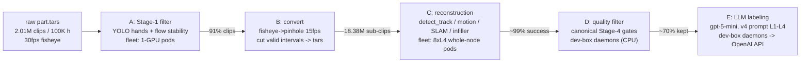

# Egocentric-100K: full production pipeline (runbook + measured numbers)

End-to-end production of a filtered, reconstructed, quality-gated, language-annotated
hand-manipulation dataset from `gs://foundational-research/hoi-dataset/Egocentric-100K/`
(2.01M raw fisheye clips, ~100,400 video-hours, 231 factories / head-mounted cameras).

This doc is the operational handoff: architecture, every stage's script + GCS location,
the measured cost model, how to monitor/resume each component, and the pitfalls we hit
so you don't hit them again.

## Pipeline at a glance



Chase architecture: C, D, E all run **concurrently** — D discovers completed C shards via
done-markers, E discovers completed D shards via filtered manifests; GCS claim files
(`filter_run/_shards/_claims/`) let multiple D workers (box daemons + optional fleet pods)
share the queue without duplicating work. Everything is per-shard/per-clip resume-safe.

## Stage reference

Shard space is **1:1 across B/C/D/E: 3,000 shards**, keyed `shard_00000..shard_02999`.

| stage | script(s) | runs on | output (GCS) |
|---|---|---|---|
| A | `scripts/build/egocentric_stage1_mp4.py` + `scripts/fleet/egosmith_recon/{pod_entry_egocentric_stage1.sh, job_egocentric_stage1.template.yaml}` | K8s, 1-GPU pods (8/node) | `egosmith_filtered/egocentric100k/stage1/_shards/` + gathered `egocentric100k.stage1.kept.jsonl` |
| B | `scripts/build/generate_egocentric_wds.py` + `{pod_entry_egocentric_convert.sh, job_egocentric_convert.template.yaml}` | K8s, CPU pods (8/node) | `egocentric100k/frames/shard_X/<clip>.tar` + `phaseB/_shards/shard_X.manifest.jsonl` |
| C | `scripts/batch_infer.py` via `{pod_entry_egocentric_recon.sh, job_egocentric_recon.template.yaml}` | K8s, whole 8xL4 nodes | `egosmith_recon/egocentric100k/recon/outputs/shard_X/<clip>/` + `_done/shard_X.json` |
| D | `scripts/build/phase_d_incremental.py` (wraps canonical `filter_manifest_by_quality.py`) | dev box daemons; optional fleet pods (`pod_entry_phase_d.sh`, `job_phase_d_fleet.template.yaml`) | `egocentric100k/filter_run/_shards/shard_X.{filtered.jsonl,report.json}` |
| E | `scripts/annotation/run_labeling_egocentric.py` (+ `annotation_harness_reference.py`) | dev box daemons -> OpenAI API | `egocentric100k/filter_run/annotations_v4/_shards/shard_X.annotations.jsonl` |

GT datasets (taco / oakink_actions / hot3d / egodex) were labeled with
`scripts/annotation/run_labeling_gt_datasets.py` -> `<ds>/filter_run/annotations.v4.jsonl`
(163,236 clips, $975, 5.1h, 19 unannotatable).

## Measured cost model (all coefficients measured on this run)

Per-stage L4-GPU-hours per hour of the stage's own input:

| stage | coefficient | notes |
|---|--:|---|
| A | 0.084 GPU-h / raw hour | 1 GPU scans ~12x realtime |
| B | 0.079 pod-h / kept hour | CPU; GPU idle |
| C | **2.96 GPU-h / kept hour** | ~93% of total compute |
| D | ~0 | CPU, concurrent |
| E | ~$0.002 / kept sub-clip | gpt-5-mini; 174K clips/h at 10 procs on Tier-5 |

Funnel (this dataset): 91% of clips pass A; 36% of raw hours survive interval extraction;
~70% pass D. Net: **1 raw hour ≈ 1.18 L4-GPU-h end-to-end; 1 final dataset-hour ≈ 4.7 GPU-h
+ $0.26 labeling.** 90-node fleet ≈ 560 raw video-hours processed per wall-clock hour.

Fresh-dataset estimate: `1 day adapter work + (raw_hours/100K) x ~8 days on 90 L4 nodes`.
Cross-GPU: H100 = 4.76x an L4 on this workload (measured); estimates for other GPUs must
account for Amdahl (≈11% of per-clip time is fixed CPU-side; see git history discussion).

## Key configuration (why it's set this way — all A/B-tested)

- **Per-GPU processes, not one wave scheduler**: 8 independent single-GPU `batch_infer`
  processes per node. Wave barriers made 8 GPUs run at 42-48% util vs 94% solo.
  Measured: 503 -> 1,368 sub-clips/h/node (2.7x).
- **`PER_GPU_CHUNK=48`**: workers respawn every 48 clips (memory hygiene). 16 -> 48 was +15%.
- **`--no-depth_predict_all_frames`** (keyframe-only Any4D depth): GT A/B on taco+hot3d
  showed ΔATE −0.04 mm (noise) and identical scale; 39% faster. Scale solving only ever
  reads keyframe depth. `DEPTH_ALL=1` env restores dense depth if a depth-export build is
  ever wanted.
- **15 fps reconstruction** (`--target_fps 15` at Phase B): halves compute vs 30fps source.
- **Filter fps args**: `--source_fps 15 --target_fps 30` AND step thresholds doubled
  (`wrist 1.98, hand/finger 0.6, camera 0.4/1.4`) — thresholds encode velocity x frame
  interval and were tuned on 30fps data. See pitfall #1 below.
- **Per-clip `est_focal.txt`** from `extra.pinhole_focal` (per-worker fisheye undistort
  focal, range 138-213). Load-bearing: a 30% focal error breaks SLAM.

## Operational runbook

### Dev box daemons (this machine)
```bash
# status
pgrep -fc 'incrementa[l].py --workers'   # Phase D procs (expect ~8)
pgrep -fc 'labeling_eg[o].py --workers'  # labelers (expect ~10)
tail /root/egosmith_annotations/phase_d_daemon.log ego_daemon_p*.log
# relaunch everything (idempotent, resume-safe)
bash /root/egosmith_annotations/rescale_all.sh
```
Requires `OPENAI_API_KEY` in env for labelers. All state is durable: per-shard JSONLs in
`/root/egosmith_annotations/ego/`, claims + done markers on GCS. Kill/restart loses only
in-flight clips. NOTE: kill daemons by PID or with patterns like `'incrementa[l]'` —
a plain `pkill -f name.py` matches your own shell and kills it (exit 144).

### Fleet jobs
```bash
TOK=$(gcloud auth print-access-token)   # gke-gcloud-auth-plugin may be missing; use --token
kubectl --token=$TOK get job ego-recon-full -n airflow
# resume/relaunch: re-apply the same YAML — skip-if-done makes it free
kubectl --token=$TOK apply -f <rendered yaml>
```
Pod entries are pulled fresh from `gs://.../egosmith_recon/fleet/` at pod start —
script fixes need **no image rebuild**, just `gcloud storage cp` the new script.
Code changes go in `egosmith_code.tar.gz` (same bucket), overlaid onto /repo at start.

### Monitoring one-liners
```bash
# progress counts
gcloud storage ls 'gs://.../egosmith_recon/egocentric100k/recon/outputs/_done/*.json' | wc -l   # C
gcloud storage ls 'gs://.../egosmith_filtered/egocentric100k/filter_run/_shards/*.filtered.jsonl' | wc -l  # D
gcloud storage ls 'gs://.../egocentric100k/filter_run/annotations_v4/_shards/*.annotations.jsonl' | wc -l  # E
```

## Pitfalls hit on this run (each cost hours-to-days; all fixed in the committed scripts)

1. **fps-dependent quality gates**: the filter's step thresholds assume 30fps input; on
   15fps data they mass-drop fast-but-smooth motion (54.9% keep vs the correct 74.7%).
   Diagnostic: dropped clips' max wrist step all < π (real glitches show ≥π single-frame flips).
2. **torch.hub phones home even when cached**: `uniception` loads DINOv2 with no ref;
   any pod-egress blip kills every SLAM worker (`worker_exited_without_result`).
   Fixed via `patch_dinov2.py` (applied at pod start; makes the fallback truly offline).
3. **Ephemeral-storage eviction**: failed clips' partial outputs (~30-40MB each) leak on
   disk; over 5h shards this evicted pods fleet-wide (BackoffLimitExceeded after 3,000
   evictions). Fix: delete ALL chunk outputs after upload, per-GPU tmp dirs wiped per chunk.
   Also: nodes allocate ~162Gi ephemeral; a 200Gi request silently blocks autoscaling.
4. **`tail -2 file1 file2` is invalid** in modern coreutils ("option used in invalid
   context") — under `set -e` this crashed every pod after it finished its work.
5. **0-for-N guard needs attrition-awareness**: a shard whose only remaining clips are
   genuine recon failures would retry forever; only treat 0-for-N as systemic when
   `skipped_done == 0`.
6. **Python GIL serializes I/O-heavy thread pools**: both D and E were ~5-10x slower as
   single processes with many threads; process-sharding fixed both. Related: spawning
  `gcloud` per clip costs ~1s CPU each — use gcsfs in-process.
7. **SHARD env from Indexed Jobs**: use the fieldRef
   `metadata.annotations['batch.kubernetes.io/job-completion-index']`; `$(JOB_COMPLETION_INDEX)`
   silently passes a literal string (pods "complete" doing nothing).
8. **Done-markers must never be overwritten** by restart mop-up paths (guard with an
   existence check) and count-verify uploads before writing them.

## State at handoff (2026-08-18)

- A, B complete. C ~58%+ (ETA ~Aug 21), D + E chasing in near-real-time (ETA ~Aug 22 for
  the fully annotated dataset). Expected final: ~13M sub-clips / ~25K hours / L1-L4 captions.
- Remaining after completion: final gather (merge per-shard filtered manifests + funnel
  stats into `egocentric100k/filter_run/clip_manifest.filtered.jsonl`), repoint descriptor
  paths to `gs://`, add the dataset to `docs/filtered_dataset.md` + bucket README (follow
  the pattern of the four existing datasets).
- Labeling spend: four GT datasets $975 (done); Egocentric tracking ~$25-30K
  (approved $36K, hard cap `EGO_LABEL_MAX_SPEND=45000`).
- EgoForce evaluation (rejected as C replacement — camera-space only, no speed win with
  world-space required) and the depth A/B are documented in artifacts + git history.
